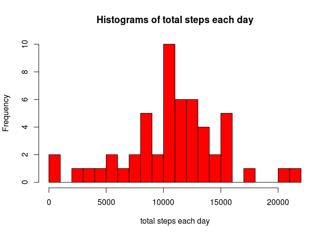

# Reproducible Research: Peer Assessment 1


## Loading and preprocessing the data

```r
unzip("activity.zip");
activity = read.csv("activity.csv", header = T, 
                                    comment.char = "", 
                                    na.strings = "NA",
                                    colClasses = c("integer", "factor", "integer"));
# Transform the dates into R date object
temp = as.Date(activity$date, format = "%Y-%m-%d");
activity$date = temp;
rm(temp);
```


## What is mean total number of steps taken per day?

```r
total_steps = aggregate(activity$steps, by = list(activity$date), sum);

hist(total_steps$x, col = "red", breaks = 25, xlab = "total steps each day", main = "Histograms of total steps each day")
```

 

```r
mean_steps = mean(total_steps$x, na.rm = T)
print(mean_steps);
```

```
## [1] 10766.19
```

```r
median_steps = median(total_steps$x, na.rm = T)
print(median_steps);
```

```
## [1] 10765
```


## What is the average daily activity pattern?

```r
bad = is.na(activity$steps);
activity_no_na = activity[!bad, ]
total_steps_per_interval = aggregate(activity_no_na$steps, by = list(activity_no_na$interval), mean);

time = as.ts(total_steps_per_interval$Group.1)

plot(time, total_steps_per_interval$x, type = "l", ylab = "mean number of steps per 5 min interval", main = "time-series of number of steps per interval")
```

 

```r
# Find the interval during which the number of steps is maximum
total_steps_per_interval[total_steps_per_interval$x == max(total_steps_per_interval$x),]
```

```
##     Group.1        x
## 104     835 206.1698
```

## Imputing missing values

```r
bad = is.na(activity$steps);

na_values = length(bad[bad == TRUE]);
print(na_values);
```

```
## [1] 2304
```

To fill in the missing values, we can replace them by the corresponding mean


## Are there differences in activity patterns between weekdays and weekends?

```r
day = factor(c("weekday", "weekend"))
```

........TO BE CONTINUED !!!
